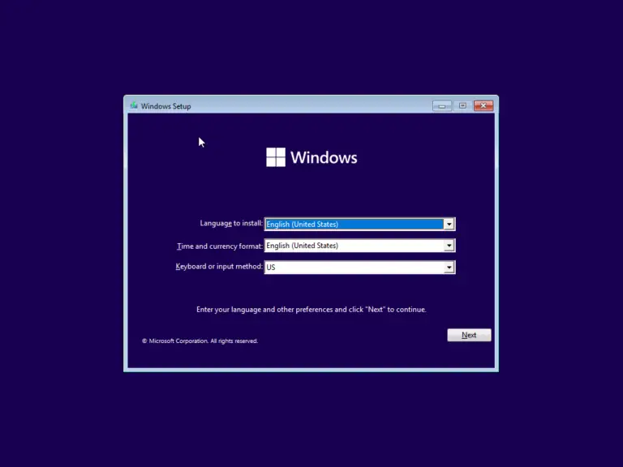

# Dev_Setup
Setup Development Environment

#Assignment: Setting Up Your Developer Environment

#Objective:
This assignment aims to familiarize you with the tools and configurations necessary to set up an efficient developer environment for software engineering projects. Completing this assignment will give you the skills required to set up a robust and productive workspace conducive to coding, debugging, version control, and collaboration.

#Tasks:

1. Select Your Operating System (OS):
   Choose an operating system that best suits your preferences and project requirements. Download and Install Windows 11. https://www.microsoft.com/software-download/
   I downloaded Windows 11 from Microsoft's official site.
i followed the instructions provided on the website to install Windows 11 on my machine. 

2. Install a Text Editor or Integrated Development Environment (IDE):
   Select and install a text editor or IDE suitable for your programming languages and workflow. Download and Install Visual Studio Code. https://code.visualstudio.com/Download
   I downloaded Visual Studio Code (VS Code) from Visual Studio Code Download.
I installed VS Code by following the installation wizard.
[text](<Screenshot of vscode-1.jfif>)

3. Set Up Version Control System:
   Install Git and configure it on your local machine. Create a GitHub account for hosting your repositories. Initialize a Git repository for your project and make your first commit. https://github.com
   I downloaded and installed Git from Git's official site.
I set up Git by configuring my username and email:
I Created a GitHub account at GitHub.
I Initialized a Git repository for my project:
And Made my first commit

4. Install Necessary Programming Languages and Runtimes:
  Instal Python from http://wwww.python.org programming language required for your project and install their respective compilers, interpreters, or runtimes. Ensure you have the necessary tools to build and execute your code.
  I downloaded and installed Python from Python's official site.
I Verified Python installation using git
[text](<screenshot of python.jfif>)

5. Install Package Managers:
   If applicable, install package managers like pip (Python).

I ensured pip was installed with Python (it usually is by default).
i verified pip installation in git

6. Configure a Database (MySQL):
   Download and install MySQL database. https://dev.mysql.com/downloads/windows/installer/5.7.html
I downloaded MySQL from MySQL Installer.
I followed the installation wizard to install MySQL.
I Configured MySQL by setting up a root password and other necessary settings.

7. Set Up Development Environments and Virtualization (Optional):
   Consider using virtualization tools like Docker or virtual machines to isolate project dependencies and ensure consistent environments across different machines.
I downloaded and installed Docker from Docker's official site.
I followed the installation instructions for Docker.

8. Explore Extensions and Plugins:
   Explore available extensions, plugins, and add-ons for your chosen text editor or IDE to enhance functionality, such as syntax highlighting, linting, code formatting, and version control integration.
   I opened VS Code and went to the Extensions view by clicking the Extensions icon in the Activity Bar on the side of the window.
I searched for and installed extensions like Python, GitLens, Dart, and ESLint.

9. Document Your Setup:
    Create a comprehensive document outlining the steps you've taken to set up your developer environment. Include any configurations, customizations, or troubleshooting steps encountered during the process. 
  During the setup process, I faced several challenges, particularly with configuring MySQL. The installation wizard initially failed due to missing dependencies. To resolve this, I researched the error online and found that updating my system and reinstalling the missing libraries solved the problem. Additionally, setting up Git for the first time required understanding how to configure SSH keys for secure communication with GitHub. I followed GitHub's official documentation to generate and add my SSH key, which streamlined the process of pushing commits to my remote repository.  

#Deliverables:
- Document detailing the setup process with step-by-step instructions and screenshots where necessary.
- A GitHub repository containing a sample project initialized with Git and any necessary configuration files (e.g., .gitignore).
- A reflection on the challenges faced during setup and strategies employed to overcome them.

#Submission:
Submit your document and GitHub repository link through the designated platform or email to the instructor by the specified deadline.

#Evaluation Criteria:**
- Completeness and accuracy of setup documentation.
- Effectiveness of version control implementation.
- Appropriateness of tools selected for the project requirements.
- Clarity of reflection on challenges and solutions encountered.
- Adherence to submission guidelines and deadlines.

Note: Feel free to reach out for clarification or assistance with any aspect of the assignment.
